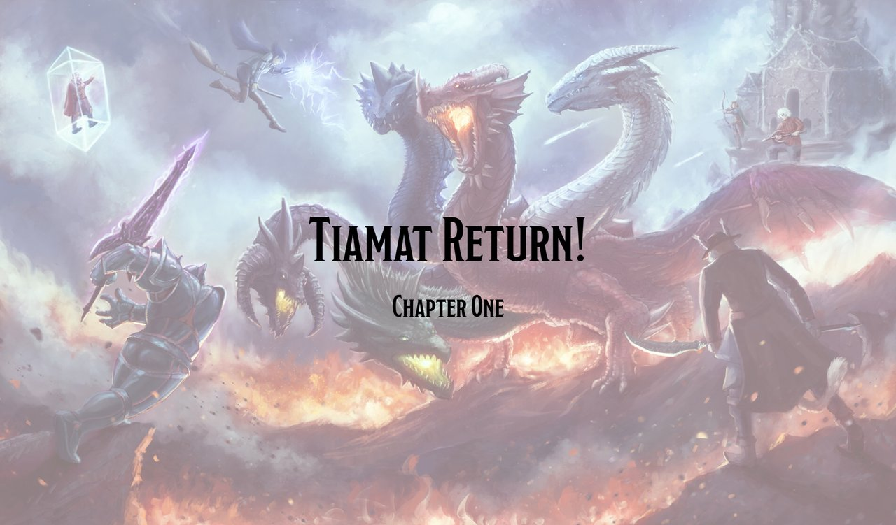
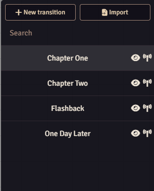
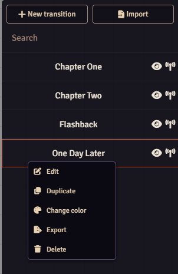
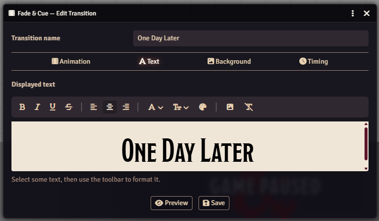
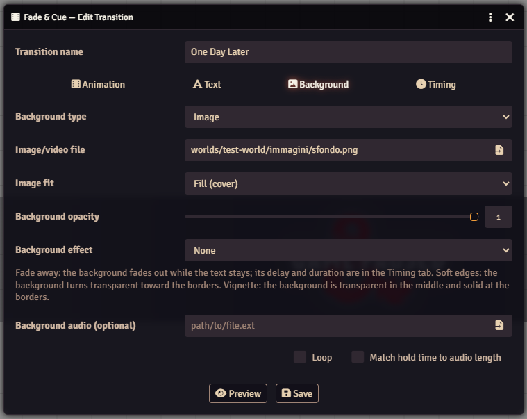
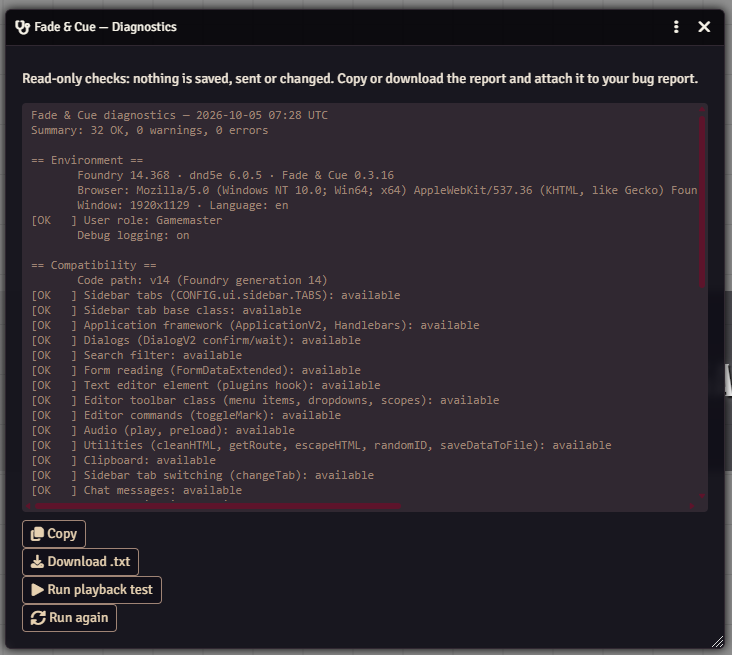

# Fade & Cue

Full-screen cinematic transitions with text, images, video and audio, sent by the GM to every player.

Use them for chapter titles, time skips, flashbacks or the name of a new location. You build a library of transitions before the session and send one with a click when the moment comes. If you link a scene, the map changes while the transition covers the screen, so your players see the new place appear.



**Compatibility:** Foundry VTT v13 and v14. Works with any game system. Interface in English.

## Installation

In Foundry, open **Add-on Modules → Install Module**, paste this manifest URL and click **Install**:

```
https://github.com/therealsega87/fade-and-cue/releases/latest/download/module.json
```

Then enable **Fade & Cue** in your world from **Game Settings → Manage Modules**.

## Quick start

1. Open the **Fade & Cue** tab in the right sidebar. It has a film icon and sits after Scenes. Players don't see it.
2. Click **New transition**, write your text, pick a background and click **Save**.
3. Click the **eye** icon to watch it on your own screen.
4. Click the **antenna** icon to send it to every connected player.

## The sidebar tab

<p>
  
  
</p>

At the top you find **New transition**, **Import** and a search box. The tab lists your transitions in alphabetical order.

Each row has two icons: the **eye** previews the transition on your screen, the **antenna** sends it to everyone. Click a name to edit that transition.

Right-click a row to **Edit**, **Duplicate**, **Change color**, **Export** or **Delete** it. Row colors help you group transitions by chapter, location or mood.

**Delete all transitions** sits at the bottom of the tab. It asks you to confirm, with *No* as the default answer.

## The editor

### Animation

Choose **Fade**, **Slide** or **Wipe**. Slide and Wipe also take a **direction**: left, right, up or down.

### Text



The editor uses Foundry's own text editor. Select some text, then use the toolbar:

- **Bold**, **italic**, **underline** and **strikethrough**
- **Alignment**: left, center or right
- **Font**, **size** in pixels and **color**, which can change from word to word
- **Image** and **clear formatting**

### Background



- **Background type**: a solid color, an image or a video.
- **Image fit**: fill the screen, fit inside it or keep the original size. Videos can loop and play muted.
- **Background opacity**: below 100%, your players see the game through the background.
- **Background effect**:
  - *Fade away*: the background fades out and the text stays on screen.
  - *Soft edges*: the background stays solid in the middle and fades toward the borders.
  - *Vignette*: the background fades toward the middle and stays solid at the borders.
- **Background audio**, with **Loop** and **Match hold time to audio length**.

### Timing

- **Fade in**, **Hold on screen** and **Fade out**, in milliseconds.
- **Fade away delay** and **Fade away duration**, used by the *Fade away* effect.
- **Activate scene**: the scene you pick here becomes active while the transition covers the screen.
- **Players can skip this transition**.

## During a transition

Your players watch and can't use the game underneath until the transition ends.

As GM, you can always close a transition: hover the top center of the screen to reveal the **X**, or press **Esc**. When you close it, it closes for everyone.

A player can close it only when you enable **Players can skip this transition**, and the player closes it on their own screen alone.

Fade & Cue plays the audio on Foundry's **Music** channel, so each player hears it at their own Music volume. The module loads each audio file before the transition starts, so sound and picture begin together.

## Import and export

**Export** (right-click a row) saves the transition as a `.json` file. **Import** (top of the tab) adds a saved file as a new transition. If you already have a transition with that name, the new one gets a number, as in *Chapter One (1)*.

When an image, video or audio file is missing on the new server, Fade & Cue imports the transition anyway and posts a chat message, visible to GMs, that lists the missing files.

## Settings

Open **Game Settings → Configure Settings → Fade & Cue**. Only the GM sees these settings.

- **Default audio volume**: base volume for transition audio, from 0 to 1. Each player's Music volume applies on top of it.
- **Scene change delay**: the time between the transition covering the screen and the scene change. Raise it if your players catch a glimpse of the map switching. The editor warns you when this delay is longer than the hold time.
- **Enable debug logging**: writes details to the browser console (F12) for you and your players. Player consoles show the title of each transition and nothing of its content.
- **Run diagnostics**: see *Reporting a bug*.

## Privacy and permissions

Only GMs and Assistant GMs can send transitions. Foundry's server checks this, so a player can't send one even from the browser console.

Fade & Cue stores your library in your GM user account. Players never receive it and can't read a transition before you send it. A second GM account starts with an empty library; use **Export** and **Import** to share transitions between accounts or worlds.

## Reporting a bug

1. Open **Game Settings → Configure Settings → Fade & Cue → Run diagnostics**.
2. If the problem is about playback, click **Run playback test** as well.
3. Click **Download .txt** or **Copy**.
4. Open an issue on [GitHub](https://github.com/therealsega87/fade-and-cue/issues), tell us what happened and attach the report.



The report lists versions, active modules and the result of each check. It leaves out the names and text of your transitions. You can also run it from the console with `game.modules.get('fade-and-cue').api.diagnose()`.

## Foundry v13

The v13 text editor has no font size or text color tools, so Fade & Cue adds its own two buttons on v13. Text you style on v13 looks the same on v14, and the other way round.

## Support

You can support Fade & Cue on [Ko-fi](https://ko-fi.com/therealsega).

## License

MIT. See [LICENSE](LICENSE).
